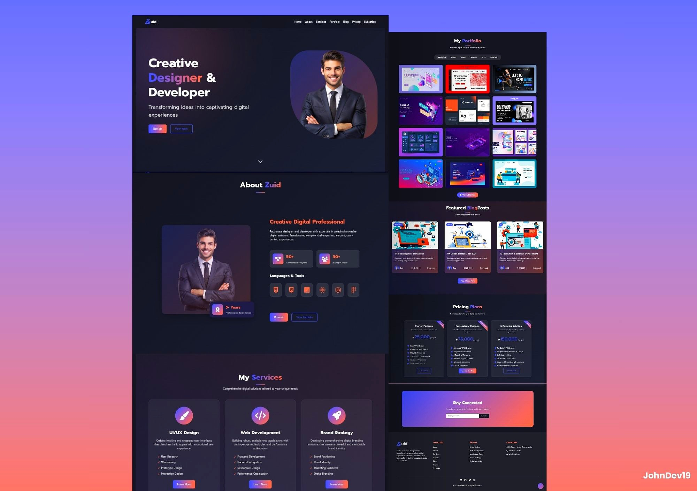
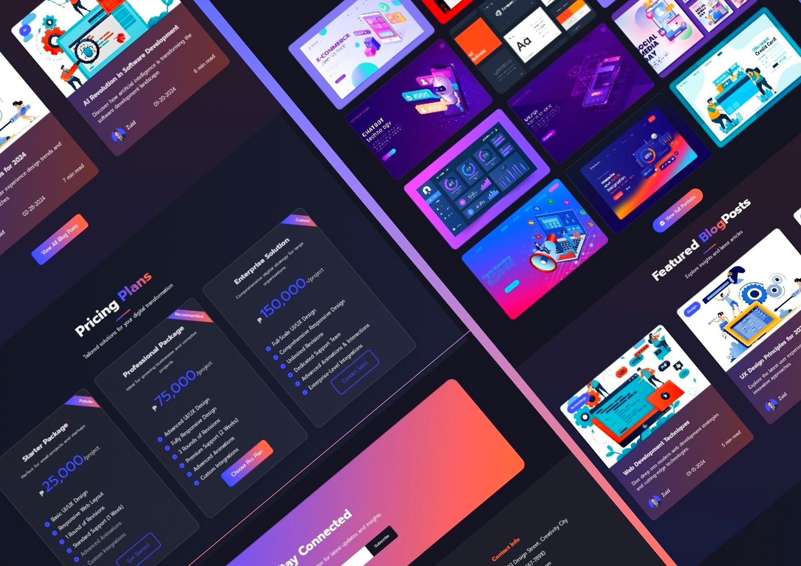

# ZUID - Creative Portfolio Website

## 🌟 Overview
ZUID is a modern and fully responsive personal portfolio website for creative professionals.

📌 [LIVE DEMO](https://johndev19.github.io/Zuid/)

### Sections
1. Navigation
2. Hero Section
3. About Section
4. Services Section
5. Portfolio Section
6. Blog Section
7. Pricing Section
8. Subscribe Section
9. Footer

## 🛠 Technologies Used
- HTML5
- CSS3
- JavaScript
- Font Awesome
- AOS (Animate On Scroll)
- Swiper.js
- Google Fonts

## 🌈 Color Palette
- Primary Color: #4454fe
- Secondary Color: #ff6f4c
- Background Dark: #141520
- Text Light: #e2e2e2

## 🤝 Contributing
> - Fork the repository
> - Create your feature branch (git checkout -b feature/AmazingFeature)
> - Commit your changes (git commit -m 'Add some AmazingFeature')
> - Push to the branch (git push origin feature/AmazingFeature)
> - Open a Pull Request

## 📄 License
Distributed under the MIT License. See [LICENSE](LICENSE) for more information.

Designed and Developed with ❤️ by [JohnDev19](https://www.facebook.com/profile.php?id=61551205372198)
